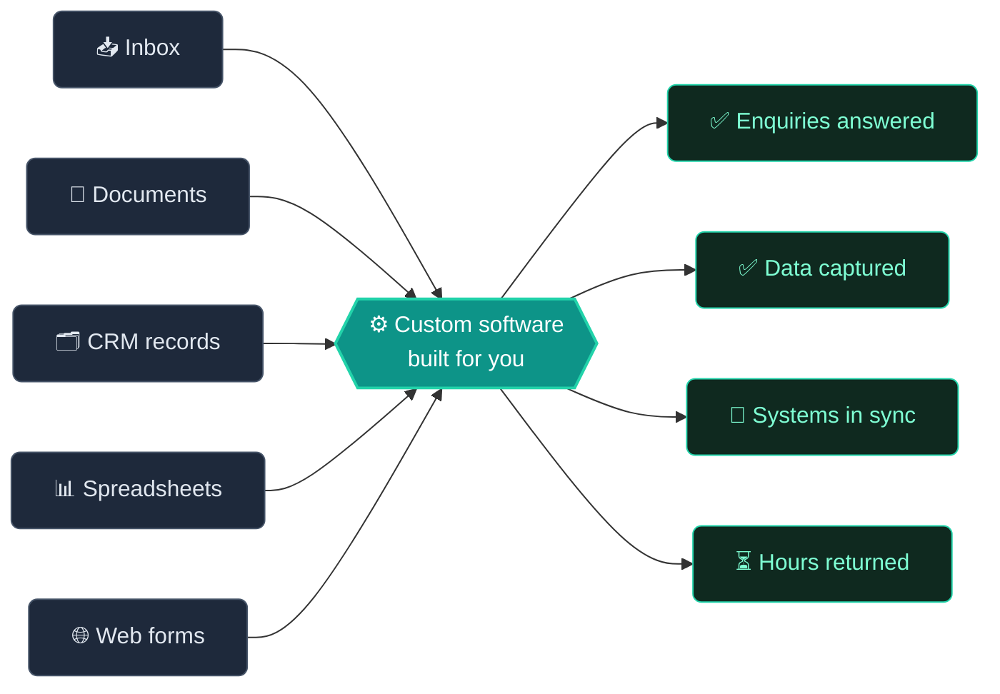

<!--
  ══════════════════════════════════════════════════════════════
   AVGe0rgiev23 / AVGe0rgiev23  →  GitHub Profile README
   Palette: ink #0F172A · teal #0D9488 · mint #22D3AA · grey #8B949E
   All cards use transparent backgrounds so this looks right in
   BOTH GitHub light mode and dark mode.
  ══════════════════════════════════════════════════════════════
-->

<div align="center">


<a href="https://agility-scaffold-tmp.vercel.app/">
  
</a>

<br/>

<a href="https://agility-scaffold-tmp.vercel.app/"></a>
<a href="https://www.linkedin.com/in/alex-georgiev-028741417"></a>
<a href="mailto:avgeorgiev25@gmail.com"></a>
<a href="https://www.instagram.com/georgiewv777/"></a>
<br/>


</div>

<br/>

<!-- ────────────────────────────  WHOAMI  ──────────────────────────── -->

##  `whoami`

```ts
const alex = {
  role:        "Founder & Engineer @ AGility",
  based:       "Burgas, Bulgaria 🇧🇬  →  clients worldwide",
  studying:    "Computer Programming @ VSCPI Burgas",
  buildsFor:   "growing businesses drowning in manual work",
  focus:       ["AI automation", "internal tools", "custom SaaS", "API integrations"],
  learning:    ["agent frameworks", "RAG at scale", "distributed system design"],
  philosophy:  "Start from the result, not the technology.",
  codeFirst:   true,   // own your software, don't rent your workflow
  funFact:     "I'll talk myself out of a project if you don't need it built.",
};
```

> **The short version:** businesses don't wake up wanting *"AI"*. They wake up thinking *we're paying good people to copy and paste.*
> I write the software that does that part instead — shaped around how the business actually runs.

<br/>

<!-- ────────────────────────────  THE DIAGRAM  ──────────────────────────── -->

## 🔁 What I actually do, in one diagram



<div align="center"><sub><i>Manual work goes in. Reclaimed hours come out.</i></sub></div>

<br/>

<!-- ────────────────────────────  SERVICES  ──────────────────────────── -->

## 🧰 What I build

<div align="center">

| | | |
|:--|:--|:--|
| 🤖 **AI assistants** | 💬 **Chatbots** | 🎫 **Support systems** |
| 📧 **Email automation** | 📑 **Document processing** | 🛠️ **Internal tools** |
| 🔄 **CRM integrations** | ⚡ **Workflow automation** | 📈 **AI dashboards** |
| 🔌 **API integrations** | 🚀 **Custom SaaS** | 🧩 **…and whatever fits** |

</div>

<details>
<summary><b>⚙️ One build. Three ways to work together.</b> <sub>(click)</sub></summary>

<br/>

| Model | Who holds the infrastructure | Who runs & maintains it |
|:--|:--|:--|
| **Fully managed** | AGility operates production on your behalf | AGility |
| **Client-owned** | You hold the cloud, data & third-party accounts | Your team, or a provider you appoint |
| **Hybrid** | You hold the cloud, data & third-party accounts | AGility, with authorised access |

The custom software is **yours** under the project agreement, and your data stays your data. What changes is who holds the keys.

</details>

<details>
<summary><b>🗺️ How a project actually runs</b> <sub>(click)</sub></summary>

<br/>

```text
01 ── DISCOVERY   map where the time and money are going
02 ── DESIGN      plan the build + how it fits your existing tools
03 ── BUILD       focused increments, progress shared as it happens
04 ── DEPLOY      launch in your chosen model, tested against real work
05 ── SUPPORT     I operate it, maintain it, or hand it over properly
```

No black boxes. You know what's happening at every stage — and why it matters.

</details>

<br/>

<!-- ────────────────────────────  STACK  ──────────────────────────── -->

## 🧪 My stack

<div align="center">

**Languages & Core**


**Frameworks & Runtime**


**Data**


**AI & LLM tooling**


**Cloud, Infra & Tools**


</div>

<br/>

<!-- ────────────────────────────  STATS  ──────────────────────────── -->

## 📊 The receipts

<div align="center">


<br/><br/>

<!-- SNAKE: needs .github/workflows/snake.yml (included) + one manual run of the Action -->
<picture>
  <source media="(prefers-color-scheme: dark)" srcset="https://raw.githubusercontent.com/AVGe0rgiev23/AVGe0rgiev23/output/snake-dark.svg" />
  <source media="(prefers-color-scheme: light)" srcset="https://raw.githubusercontent.com/AVGe0rgiev23/AVGe0rgiev23/output/snake.svg" />
  
</picture>

</div>

<br/>

<!-- ────────────────────────────  EDUCATION  ──────────────────────────── -->

## 🎓 Where I'm learning it

<table>
<tr>
<td width="70">🏫</td>
<td>

**Vocational School of Computer Programming and Innovation — Burgas 🇧🇬**
*VSCPI · ПГКПИ Бургас*

The first school outside Sofia — and third in the country — to become an **associated school of Sofia University "St. Kliment Ohridski."** An entire curriculum built around software and innovation, with industry partners providing mentorship in AI and software engineering.

</td>
</tr>
</table>

<br/>

<!-- ────────────────────────────  OPEN SOURCE  ──────────────────────────── -->

## 🔓 I build in the open

Good engineering doesn't hide. I can't point you at fake five-star reviews, and I wouldn't want to — so I point you here instead:

<table>
<tr><td>📂</td><td><b>Repositories, not screenshots</b> — look at how something is actually put together.</td></tr>
<tr><td>🕓</td><td><b>Commit history you can check</b> — how a project really got built, not how it got described afterwards.</td></tr>
<tr><td>🔍</td><td><b>Standards I hold when no one's watching</b> — read the code before you ever sign anything.</td></tr>
</table>

<br/>

<!-- ────────────────────────────  CTA  ──────────────────────────── -->

<div align="center">

## 💌 Send me the process your team hates most

I'll record a **free 5-minute screen teardown** — where the time goes, what's automatable, what isn't, and what I'd do first.
Sometimes the honest answer is *"buy an existing tool."* That's a valid outcome.

`⚡ Three a week — that's the honest limit for one person.`  ·  `📞 No call required.`  ·  `🚫 No pitch attached.`

<br/>

<a href="mailto:avgeorgiev25@gmail.com?subject=Teardown%20request"></a>
<a href="https://agility-scaffold-tmp.vercel.app/book"></a>

<br/><br/>


<sub><i>Technology should earn its keep. — Alex</i></sub>

</div>

<!--
  ┌─────────────────────────────────────────────────────────────┐
  │  You found the source. That's exactly the kind of curiosity │
  │  I hire for. avgeorgiev25@gmail.com — mention the comment.  │
  └─────────────────────────────────────────────────────────────┘
-->
